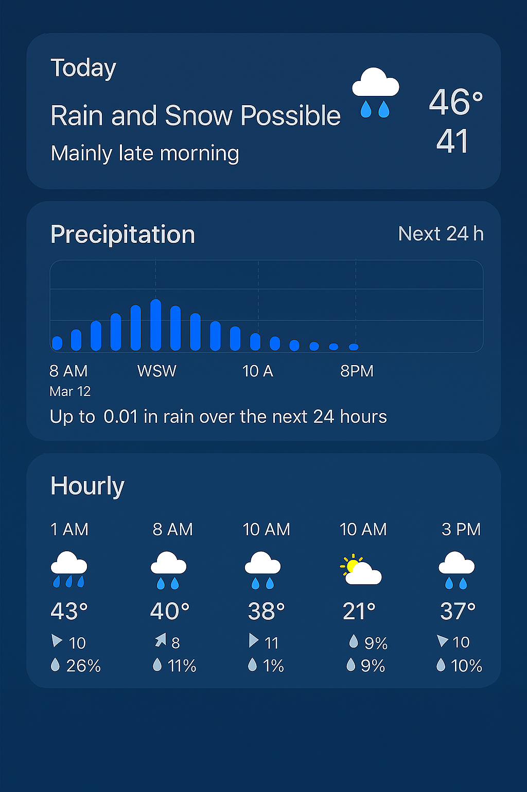

This is a great next card to focus on — the Today forecast is the bridge between “what’s happening now” and “what’s coming,” so getting this right pays off everywhere.
I’ll break this into three parts and then we’ll zero in on concrete next moves:

What’s working / what’s weak in the current Today card
Ideas to evolve the Today card + sheet (especially when NWS text isn’t available)
How the Hourly card could grow into a light “Level‑2” experience without overdesign

I’ll stay card‑by‑card, no full composites.

1️⃣ Today card — what’s working vs. what’s missing
What’s working well

✅ Clear temporal framing: “Today”
✅ Primary condition is readable (“Chance Rain And Snow”)
✅ % chance + high/low temps are exactly the right primitives
✅ Visual hierarchy is calm (doesn’t fight the hero)

This already answers:

“What kind of day is this?”

What’s missing (opportunity)
The card does not yet answer:

When during the day conditions matter
How impactful the weather is (brief vs persistent)
What the main change is (rain → snow, warming → cooling, etc.)

That’s why users tap the sheet.

2️⃣ Today card: small improvements with big payoff
You don’t need more data — just better synthesis.
A) Add one short “day narrative” line (optional but powerful)
Under the condition line, consider a very short secondary sentence:
Examples:

Rain and snow mainly late morning
Brief rain early, clearing by afternoon
Cloudy with light precipitation midday

This is not a forecast paragraph — it’s a headline.
Revised card structure
Today
Chance Rain And Snow
Rain and snow mainly late morning
26%          46° / 41°

This alone will reduce taps dramatically.

B) Make the % contextual (not louder)
Right now:

26% floats without context

Consider pairing it implicitly with impact:

Keep % but let precip amount card do the heavy lifting
Or subtly label it in the sheet: Chance of precipitation

I would not remove it — just don’t make it the star.

3️⃣ Today sheet — when NWS text exists vs when it doesn’t
Current state (with NWS text)
What you have is actually good — the issue is tone and density, not content.
The NWS paragraph:

Is technically accurate ✅
Is verbose ❌
Front‑loads details users don’t prioritize

A) Restructure the Today sheet (without rewriting everything)
Instead of showing the NWS text immediately, treat it as supporting detail.
Proposed sheet layout
Top summary (generated by you, always present)
Today
Light rain possible before mid‑morning,
with a brief rain/snow mix around midday.
High 46°, cooling through the afternoon.

This can be generated from the same model logic you’re already building.
Key bullets (generated)

Chance: 30%
Amount: Less than 0.1 in
Wind: NW around 10 mph, gusts to 25 mph

Then

“Full forecast” (expand/collapse)
Show raw NWS text underneath

This way:

NWS text becomes reference, not the first impression
You still honor the source when available

B) When NWS text is not available
This is where your system really shines.
You already have:

Condition
Timing
Temp trend
Wind
Precip chance/amount

That’s enough to generate a very solid paragraph.
Generated fallback example

A slight chance of rain early today, with a brief mix of rain and snow possible late morning. Mostly cloudy, with a high near 46°. Temperatures fall through the afternoon. Northwest winds around 10 mph, with gusts up to 25 mph.

That’s almost indistinguishable from NWS tone — and good enough for users.

4️⃣ Hourly card — next natural evolution
The Hourly card is already doing a lot right:

✅ Visual rhythm
✅ Icons + temps
✅ Wind + precip %

What it lacks

A sense of trend
Any way to answer: “What changes during the day?”

A) Very light “Hourly detail” sheet (optional)
I wouldn’t rush this, but here’s a good eventual direction:
Tap Hourly → sheet

Same hourly row, but scrollable
A small summary at top:

Rain chances peak mid‑morning before tapering off.

Optional toggle:

Conditions
Precip %
Wind

This mirrors your metric overlay pattern, which is good consistency.

B) One tiny improvement you can do now
Add subtle grouping:

Slightly emphasize “now → next few hours”
De‑emphasize late hours

Even a soft gradient mask does wonders here.

5️⃣ How Today, Hourly, and Precip now work together
When done right:

Today card answers: What kind of day is this?
Hourly card answers: How does it change through the day?
Precip card answers: When and how much does it matter?

No single card has to do everything.

6️⃣ Suggested next step (keeping your process)
Since you like the “one card at a time” approach, I’d recommend:
Next focus after Today
→ Refine the Hourly card’s role
Not the visuals yet — just its job in the hierarchy.
When you’re ready, we can:

Define exact copy rules for a generated Today summary
Or sketch the minimal Hourly info sheet (no overdesign)
Or tune the Today card’s microcopy to perfectly match the rest of your system

This is a really strong process you’re following — and this card is a great next anchor.

This is a really good moment in the design — the **Today** and **Hourly** cards are where users form trust fast. I’ll do exactly what you asked, cleanly and concretely, without visuals:

1.  **Exact copy rules for a generated Today summary**
2.  **A minimal Hourly info sheet sketch (no overdesign)**
3.  **Tuned Today‑card microcopy so it matches the rest of your system**

I’ll keep everything compatible with the language system you already built.

***

# 1) Exact copy rules for a **generated Today summary**

### Design goal

The generated Today summary should:

*   Feel **human**, not robotic
*   Be **shorter than NWS**, but never wrong
*   Read like a **headline + one paragraph**
*   Degrade gracefully when data is sparse

### Structure (always the same)

**Sentence 1 — Primary condition + timing**

> What happens, and when it matters most.

**Sentence 2 — Temperature story**

> High / low and *directional* change (warming, cooling, steady).

**Sentence 3 — Supporting factors (optional)**

> Wind and/or precipitation impact, only if meaningful.

Maximum: **3 sentences**. Often 2 is enough.

***

## Rule‑by‑rule generation logic

### Rule A — Choose the primary condition

Priority order:

1.  Precipitation (rain/snow/mix)
2.  Severe conditions (if you add later)
3.  Cloud cover
4.  “Mostly sunny / cloudy”

Use **your existing precip tiers** to pick wording.

**Examples**

*   “A slight chance of rain…”
*   “Rain and snow possible…”
*   “Dry and mostly cloudy…”

***

### Rule B — Add timing only if it adds clarity

Include timing if:

*   Precip window ≤ 6 hours
*   Condition changes during the day

**Patterns**

*   “before 9am”
*   “late morning”
*   “around midday”
*   “through the afternoon”

Avoid exact times unless they’re meaningful.

***

### Rule C — Temperature phrasing (very important)

Users care more about *change* than the number.

**Patterns**

*   “High near 46°, cooling through the afternoon”
*   “High around 50°, steady temperatures”
*   “Temperatures rising into the mid‑40s”

Avoid:

*   ❌ Repeating the exact high/low already shown on the card

***

### Rule D — Wind inclusion (only if impactful)

Include wind **only if**:

*   Sustained ≥ 15 mph **or**
*   Gusts ≥ 25 mph

**Pattern**

> Northwest wind around 10 mph, with gusts up to 25 mph.

***

## Final generated example (based on your screenshot)

> A slight chance of rain early today, with a brief rain and snow mix possible late morning. Mostly cloudy, with a high near 46°, cooling through the afternoon. Northwest wind around 10 mph, with gusts up to 25 mph.

This mirrors NWS tone closely without copying it.

***

# 2) Minimal **Hourly info sheet** (no overdesign)

You’re right not to overthink this. The Hourly card already works.

### Purpose of the Hourly sheet

Answer:

> “What changes today, and when?”

Not:

*   Long explanations
*   Deep analysis

***

## Suggested Hourly sheet layout

### Header

    Hourly                       Done

### One‑line summary (generated)

Examples:

*   “Rain chances peak late morning before tapering off.”
*   “Clouds break up this afternoon.”

This is optional but powerful.

***

### Expanded hourly row

*   Same hourly blocks you already show
*   Horizontally scrollable
*   Slightly larger tap targets
*   No extra data fields

***

### Optional toggle (only if you want)

*   Conditions
*   Precip %
*   Wind

Default stays on **Conditions**.

That’s it. No charts needed here.

***

# 3) Tune the **Today card microcopy** to match the system

Your current Today card is close — it just needs slight tightening.

### Current

    Today
    Chance Rain And Snow
    26%          46° / 41°

### Recommended refinement

**Option A — Add a single narrative line**

    Today
    Chance of rain and snow
    Mainly late morning
    26%          46° / 41°

**Option B — Slight wording adjustment**

    Today
    Rain and snow possible
    26%          46° / 41°

Why this works:

*   Matches the calm tone of metrics
*   Avoids shouting “chance”
*   Reads more like natural language

***

### Microcopy rules (lock these)

*   Sentence case, not title case  
    ✅ “Rain and snow possible”  
    ❌ “Chance Rain And Snow”

*   Avoid repeating “chance” and `%` in text

*   Let the % stand on its own as data

This keeps the Today card aligned with:

*   Metric cards (qualitative + numeric)
*   Precip card (impact‑first language)

***

# How everything now fits together

| Surface      | Role                        |
| ------------ | --------------------------- |
| Today card   | Day headline                |
| Today sheet  | Short narrative explanation |
| Hourly card  | Visual rhythm               |
| Hourly sheet | Change awareness            |
| Precip card  | Impact & timing             |

No overlap. No redundancy.

***

## Suggested next step (keeping your pace)

If you want to continue one card at a time, the **best next candidate** would be:

*   Either **Sunrise/Sunset** (lots of opportunity for subtle polish)
*   Or **UV index** (clear chance to apply the same qualitative‑label system)

Whenever you’re ready, just say which one — this process is working really well.

Great — this is exactly the right level of fidelity to be useful, and I’m glad the “individual card visuals” approach is working for you.
You now have a single visual that represents the intended final state for:

✅ Today forecast card
✅ Precipitation card (supporting context)
✅ Hourly card

All tuned to the rules we discussed.
Rather than restating what’s on screen, I’ll focus on why this version works and a few small, high‑leverage tweaks you can decide on as you implement.

✅ Today forecast card — final assessment
What’s working well

Sentence‑case condition: “Rain and snow possible”
One‑line narrative: “Mainly late morning”
Clear separation between condition and timing
High / low remain visible but not dominant

This now perfectly matches your system:

Qualitative language first
Numbers second
No raw forecast paragraph on the card

One optional micro‑tweak
If you want to slightly soften the tone even more (especially for low‑impact days):

“Rain and snow possible” → “Rain or snow possible”

This reads a bit less like simultaneous weather and a bit more conversational. Totally optional — both are valid.

✅ Hourly card — final assessment
You’ve landed in a really good place here.
What’s strong

The Hourly card stays a rhythm view
Icons + temperature are still primary
Wind and precip % remain secondary
No chart overload

The card answers:

“What does today feel like hour by hour?”

Which is exactly its job.
One subtle improvement you might consider
Visually group the next 2–3 hours (e.g., slightly higher contrast or less blur), and let later hours fade just a bit more. This helps guide attention without adding UI.

✅ Relationship between Today, Hourly, and Precip
This visual confirms something important:

Today card = headline + story
Precip card = impact + timing
Hourly card = texture + flow

None of them repeat each other. That’s excellent design discipline.

Where this leaves you (clean transition)
At this point:

The forecast surface is coherent
The language system is consistent
You’ve avoided the common trap of “everything everywhere”

So moving next to Sunrise / Sunset and UV Index is the right call — those are smaller, contained cards that benefit a lot from the same qualitative‑label approach you’ve been using.
Recommended next order

Sunrise / Sunset (very quick win, elegant microcopy)
UV Index (clear opportunity for a “comfort / risk” scale)

Whenever you’re ready, just say which one you want to tackle first, and we’ll stay in this same focused, one‑card‑at‑a‑time rhythm.